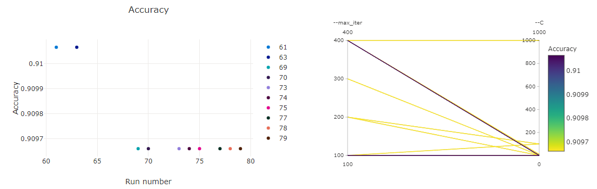

# Optimizing an ML Pipeline in Azure

## Overview
This project is part of the Udacity Azure ML Nanodegree.
In this project, we build and optimize an Azure ML pipeline using the Python SDK and a provided Scikit-learn model.
This model is then compared to an Azure AutoML run.

## Summary
**In 1-2 sentences, explain the problem statement: e.g "This dataset contains data about... we seek to predict..."**

The Bank Marketing Dataset contains data related to direct marketing campaigns (phone calls) of a Portuguese banking institution. We are trying to predict binary categorical feature “y” (will the client subscribe a term deposit?). 

**In 1-2 sentences, explain the solution: e.g. "The best performing model was a ..."**

The best performing model was a voting Ensemble(0.9175417298937785) from automl. Voting ensemble works by combining the predictions from multiple models. In classification, the final prediction is the majority vote of contributing models.

## Scikit-learn Pipeline
**Explain the pipeline architecture, including data, hyperparameter tuning, and classification algorithm.**

We first load the bank marketing data. We then clean and onehot encode it. We train a scikit-learn LogisticRegression algoithm and then use hyperdrive for hyperparameter tuning. We finally get the best run model and save it. The best run was with hyperparameters Regularization Strength: 0.001, Max iterations: 100
with accuracy of  0.910065756196257

**What are the benefits of the parameter sampler you chose?**

Random Sampling supports discrete and continuous hyperparameters. It supports early termination of low performance runs.

**What are the benefits of the early stopping policy you chose?**

Bandit Policy lets us choose the range of tolerance for primary metric.

## AutoML
**In 1-2 sentences, describe the model and hyperparameters generated by AutoML.**

Automate ML checks different algorithms and tunes their hyperparameters. The hyper parameters for Voting Ensemble are 'ensembled_iterations': '[0, 1, 24, 19, 22, 4, 21, 20]', 'ensembled_algorithms': "['LightGBM', 'XGBoostClassifier', 'LightGBM', 'SGD', 'LightGBM', 'SGD', 'RandomForest', 'ExtremeRandomTrees']", 'ensemble_weights': '[0.46153846153846156, 0.07692307692307693, 0.07692307692307693, 0.07692307692307693, 0.07692307692307693, 0.07692307692307693, 0.07692307692307693, 0.07692307692307693]' and the best_individual_pipeline_score is 0.9153262518968133. The accuracy is 0.9175417298937785.

## Pipeline comparison
**Compare the two models and their performance. What are the differences in accuracy? In architecture? If there was a difference, why do you think there was one?**

In the hyperdrive run, we are only getting a single algorithm and tuning it. In automl run, a wide range of algorithms are tested. The accuracy from hyperdrive was "0.910065756196257"(Logistic Regression with Regularization Strength: 0.001, Max iterations: 100) and from automl was "0.9175417298937785"(voting Ensemble). There is a slight difference in accuracy. This is because we are training different algorithms(including ensembles) in automl. Ensembles generally work better as they combine predictions from multiple models.

## Future work
**What are some areas of improvement for future experiments? Why might these improvements help the model?**

In automl run, we see the following in the DATA GUARDRAILS:

TYPE:         Class balancing detection

STATUS:       ALERTED

DETAILS:      Imbalanced data can lead to a falsely perceived positive effect of a model's accuracy because the input data has bias towards one class.

<pre>
|Size of the smallest class|Name/Label of the smallest class|Number of samples in the training data|
+--------------------------+--------------------------------+--------------------------------------+
|3692                      |yes                             |32950                                 |
</pre>

We can handle Class Imbalance Problem with weighted metrics or under/over – sampling techniques. 

In weighted loss method, loss function is changed to ensure "equity". 
<pre>L'(X,y)= -w1*log(P(Y=1|X)) if y=1
         -w2*log(P(Y=0|X)) if y=0</pre>

where w1=(class0 cases)/(total cases) and w2=(class1 cases)/(total cases) ; class0 and class1 cases represent the majority and minority cases respectively.

In sampling techniques, we can add copies of instances from the under-represented class called over-sampling (or more formally sampling with replacement), or we can delete instances from the over-represented class, called under-sampling.  

## Proof of cluster clean up
**If you did not delete your compute cluster in the code, please complete this section. Otherwise, delete this section.**
**Image of cluster marked for deletion**

